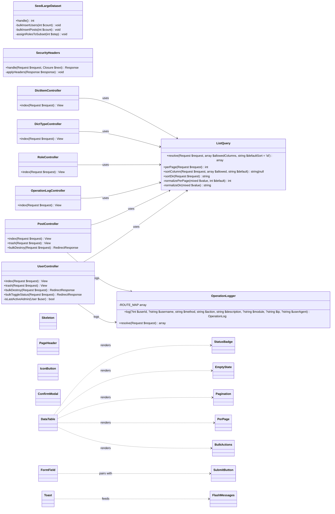
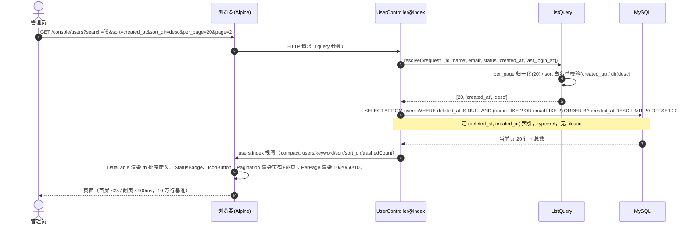
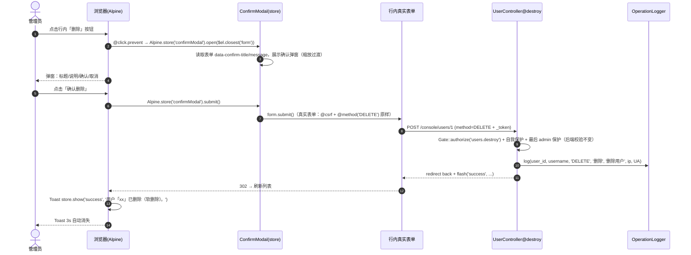
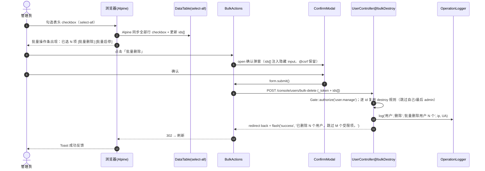
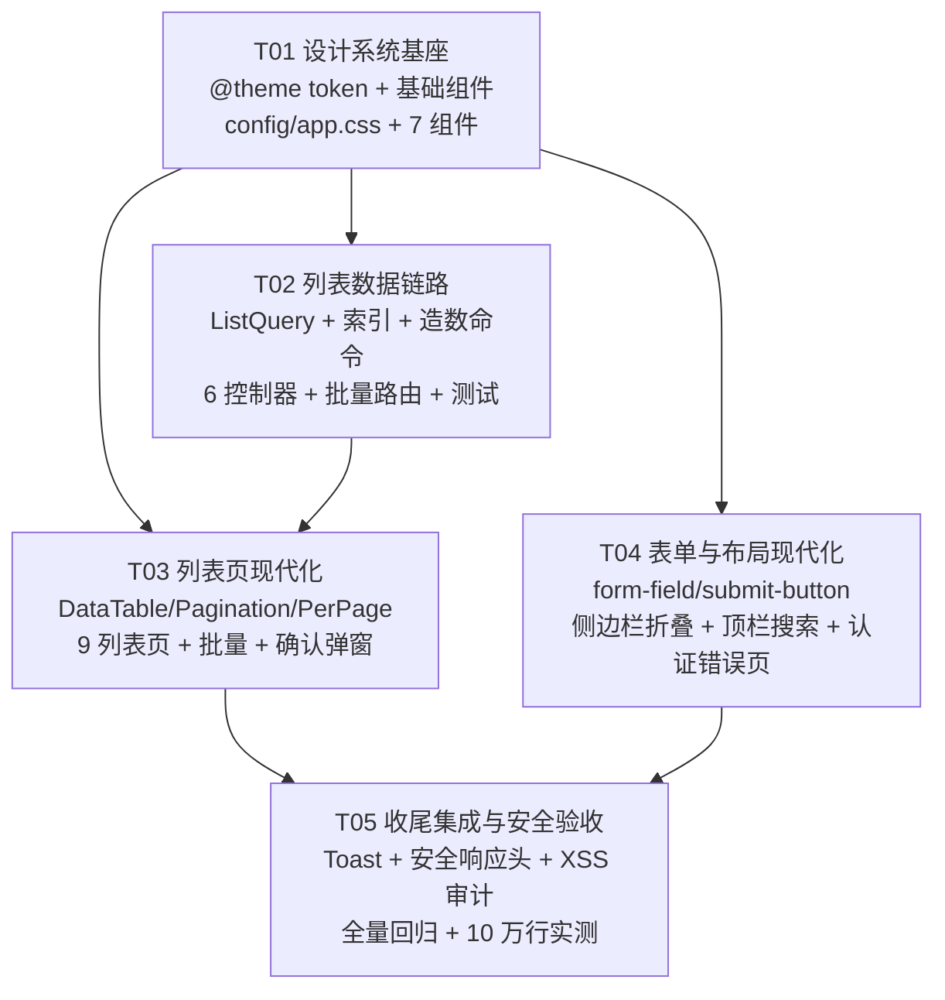

# general-admin UI 现代化重构 · 增量架构设计与任务分解

> 版本：v1.0（第 2 阶段产出，交付工程师实现 / QA 验证）
> 日期：2026-09-17
> 作者：架构师 高见远
> 输入：`docs/prd-ui-refactor.md`（产品经理许清楚，v1.0）
> 基线：`php artisan test` = **181 passed (575 assertions)**（已实测确认，全绿）

---

## 0. 待确认问题结论（回应 PRD §7）

| # | PRD 问题 | 结论 |
| --- | --- | --- |
| 1 | 是否引入第三方 UI 组件库 | **不引入**。保持 Blade 组件 + Tailwind 原子类 + Alpine，与现有风格一致、零新增依赖。 |
| 2 | 大数据量验收基准 10 万行 | **确认 10 万行**。提供 `php artisan app:seed-large-dataset` 造数命令（MySQL 下验证；sqlite 测试仅用小批量）。 |
| 3 | 列表交互 JS 形态 | **URL 驱动 + Alpine 增强**。筛选/排序/分页全部进 URL query（服务端处理，可刷新/分享/回退）；勾选、跳页、toast、确认弹窗用 Alpine 前端增强。 |

---

# Part A：系统设计

## 1. 实现思路（Implementation Approach）

### 1.1 核心难点与对策

| 难点 | 对策 |
| --- | --- |
| 设计 token 收敛到 Tailwind v4 `@theme`，且不破坏现有 10 个工具类 | `@theme` 只做**增量**语义 token（primary/success/warning/danger/info、radius、shadow、spacing、animate）；现有 `.btn-*/.card/.input` 等工具类**保留类名**、仅把内部色值改为语义 token。旧页面零改动也保持视觉一致（primary 取 indigo 色值、success 取 emerald 色值…与现页面一致）。 |
| 组件化程度低、8 模块重复手写 | 新增 15 个匿名 Blade 组件（`resources/views/components/*.blade.php` 自动注册为 `<x-*>`），列表页/表单页逐步替换重复块。 |
| 大数据量不卡死 | 服务端分页 + URL 驱动；`per_page` 白名单（10/20/50/100）；关键查询补索引；`with()` 预加载消除 N+1；导出维持 `FromQuery` 流式（不改）。 |
| 原生 `confirm()` 生硬 | 统一 `x-confirm-modal`，**不替换表单本身**：真实表单（`@csrf` + `@method`）原样保留，仅把提交动作改为先弹确认框，确认后 `form.submit()`——后端校验、CSRF、Gate 全部不变。 |
| 排序注入风险 | 新增 `App\Support\ListQuery`，排序字段**白名单**校验 + `sort_dir` 仅允许 asc/desc。 |
| 动效/反馈缺失 | Alpine store 实现 Toast（全局）、ConfirmModal（全局）、侧边栏折叠（localStorage）；页面淡入用 x-data + transition-opacity，不引入第三方动画库。 |

### 1.2 技术选型（全部为既有栈，零新增依赖）

- **Blade 匿名组件**（Laravel 自带）：组件化渲染。
- **Tailwind CSS v4 `@theme`**：设计 token；`@layer components` 保留现有工具类；`@custom-variant dark` 现有暗色方案不动。
- **Alpine.js v3**（已装）：微交互（弹窗、toast、折叠、勾选、跳页、loading）。仅用核心库，**不引入 `@alpinejs/collapse` 等插件**（折叠用 `x-show` + opacity 过渡即可）。
- **spatie/laravel-permission + maatwebsite/excel**：RBAC 与流式导出，维持现状。
- 架构模式：**MVC + 服务端渲染**，新增一个薄帮助类 `App\Support\ListQuery`（查询参数解析），无服务层过度抽象。

### 1.3 设计原则

1. **最小变更**：不改路由结构、数据表结构（仅加索引）、RBAC 模型、业务逻辑；只改视图 + 查询参数处理。
2. **兼容优先**：控制器无 query 参数时行为与现在完全一致（默认排序 `latest()`、默认每页 `config('app.pagination', 15)`）。
3. **可复制**：列表/表单骨架组件化，新模块可直接套用（DEV-1/DEV-2）。

---

## 2. 文件清单（File List）

### 2.1 新增文件

```
config/app.php                                  [改] 增加 allowed_per_page / sort 相关配置
resources/css/app.css                           [改] @theme token + 工具类迁移 + 新增 .btn-icon/.input-error/.th-sortable 等
resources/js/app.js                             [改] Alpine store（toast / confirmModal / sidebar）+ 全局辅助

resources/views/components/status-badge.blade.php
resources/views/components/empty-state.blade.php
resources/views/components/skeleton.blade.php
resources/views/components/page-header.blade.php
resources/views/components/icon-button.blade.php
resources/views/components/confirm-modal.blade.php
resources/views/components/data-table.blade.php
resources/views/components/pagination.blade.php
resources/views/components/per-page.blade.php
resources/views/components/bulk-actions.blade.php
resources/views/components/form-field.blade.php
resources/views/components/submit-button.blade.php
resources/views/components/toast.blade.php

app/Support/ListQuery.php                        [新] 查询参数解析（per_page/page/sort/sort_dir 白名单）
app/Console/Commands/SeedLargeDataset.php        [新] 10 万行造数命令
app/Http/Middleware/SecurityHeaders.php          [新] 安全响应头
database/migrations/2026_09_17_000010_add_listing_indexes.php   [新] 列表查询索引

tests/Feature/ListQueryTest.php                  [新] 查询参数解析 + 每页条数 + 排序白名单
tests/Feature/QueryCountTest.php                 [新] 列表页 SQL 常数（N+1 回归）
tests/Feature/SecurityHeadersTest.php            [新] 安全响应头
tests/Feature/ConfirmModalGrepTest.php           [新] grep confirm( = 0（防回归）

docs/sequence-diagram.mermaid                    [新] 时序图（抽取件）
docs/class-diagram.mermaid                       [新] 类图（抽取件）
```

### 2.2 修改文件

```
app/Http/Controllers/UserController.php          [改] per_page/sort 支持 + 批量删除/批量启停
app/Http/Controllers/PostController.php          [改] per_page/sort 支持 + 批量删除
app/Http/Controllers/OperationLogController.php  [改] per_page/sort 支持
app/Http/Controllers/RoleController.php          [改] per_page/sort 支持
app/Http/Controllers/DictTypeController.php      [改] per_page/sort 支持
app/Http/Controllers/DictItemController.php      [改] per_page/sort 支持
app/Support/OperationLogger.php                  [改] ROUTE_MAP 补充 toggle-status/restore/force-destroy/批量端点
routes/web.php                                   [改] 新增批量操作路由（挂权限组内）

resources/views/layouts/app.blade.php            [改] 顶栏全局搜索 + Toast 容器 + 页面淡入 + 侧边栏传参
resources/views/layouts/sidebar.blade.php        [改] 目录折叠（localStorage）+ 激活态保留
resources/views/auth/login.blade.php             [改] 表单组件化（视觉微调）
resources/views/errors/*.blade.php               [改] 与主后台同风格（复用 token）
resources/views/components/flash-messages.blade.php [改] 升级为 Toast 驱动（保留 DOM 文本，测试不破）

列表页（9 个，均改用 DataTable/Pagination/PerPage/StatusBadge/EmptyState/ConfirmModal）：
resources/views/users/index.blade.php
resources/views/users/trash.blade.php
resources/views/posts/index.blade.php
resources/views/posts/trash.blade.php
resources/views/roles/index.blade.php
resources/views/menus/index.blade.php
resources/views/dict-types/index.blade.php
resources/views/dict-items/index.blade.php
resources/views/logs/index.blade.php
resources/views/dashboard.blade.php               [改] 少量组件化（可选）

表单页（8 模块 create/edit + settings + profile 局部，改用 form-field/submit-button/confirm-modal）：
resources/views/users/create.blade.php
resources/views/users/edit.blade.php
resources/views/roles/create.blade.php
resources/views/roles/edit.blade.php
resources/views/menus/create.blade.php
resources/views/menus/edit.blade.php
resources/views/menus/partials/form.blade.php
resources/views/posts/create.blade.php
resources/views/posts/edit.blade.php
resources/views/dict-types/create.blade.php
resources/views/dict-types/edit.blade.php
resources/views/dict-items/create.blade.php
resources/views/dict-items/edit.blade.php
resources/views/settings/index.blade.php
resources/views/profile/partials/delete-user-form.blade.php
resources/views/profile/partials/update-password-form.blade.php
resources/views/profile/partials/update-profile-information-form.blade.php
```

> 说明：`resources/views/vendor/pagination/tailwind.blade.php` **保留不动**（作为 `$rows->links()` 兜底），列表页改为 `x-pagination`。

---

## 3. 数据结构与接口（classDiagram）



类图抽取件：`docs/class-diagram.mermaid`。

---

## 4. 程序调用流程（sequenceDiagram）

### 4.1 列表页加载（筛选 + 排序 + 每页条数 + 跳页，全部 URL 驱动）



### 4.2 破坏性操作（ConfirmModal 统一确认，表单原样提交）



### 4.3 批量勾选 + 批量删除



时序图抽取件：`docs/sequence-diagram.mermaid`。

---

## 5. 组件设计（新 Blade 组件总表）

> 全部为匿名组件（`resources/views/components/*.blade.php` → `<x-*>`），命名 kebab-case。
> 「Alpine」列：`无`=纯服务端渲染；`有`=需要 Alpine 增强（微交互）。

| 组件 | Props | 行为要点 | 用在哪些视图 | Alpine |
| --- | --- | --- | --- | --- |
| `x-status-badge` | `type`(success/warning/danger/info/neutral)、`icon`(heroicon 名)、`label`(slot)、`size`(sm/xs) | 语义色胶囊徽章；成功=emerald、警告=amber、危险=red、信息=sky、中性=gray；带可选图标 | 全部 9 个列表页的状态/类型列；dashboard 最近文章 | 无 |
| `x-empty-state` | `icon`、`title`、`description`(可空)、`colspan`、slot `action` | 居中图标+文案+可选操作按钮；可整体放进 `<tr><td :colspan>` 内 | 全部列表页 `@empty` 分支 | 无 |
| `x-skeleton` | `class`(尺寸)、`lines`、`rounded` | `animate-pulse` 灰色占位块，列表/卡片加载占位 | 列表页首屏加载（可选）、仪表盘 | 无 |
| `x-page-header` | `title`、`description`(可空)、`backUrl`(可空)、slot `actions` | 替换每页手写的 header 块（标题+副标题+右侧操作按钮组），统一响应式 | 全部 8 模块列表/表单页 | 无 |
| `x-icon-button` | `icon`、`title`(tooltip)、`variant`(ghost/danger/primary)、`href`(有则渲染 a)、slot(默认) | 图标按钮：方 8×8、圆角、hover 底色；`title` 即 tooltip + `aria-label`；href 有 → `<a>`，无 → `<button>` | 表格操作列（编辑/删除/停用/导出） | 无 |
| `x-confirm-modal` | `name`(事件名)、`confirm-text`、`cancel-text`、`variant` | 全局确认弹窗：Alpine store `confirmModal` 持有 `{form, title, message}`；触发按钮 `@click.prevent="Alpine.store('confirmModal').open($el.closest('form'))"` 并把表单的 `data-confirm-title/data-confirm-message` 读入；确认 → `store.submit()` 即 `form.submit()`；复用 Breeze modal 的焦点陷阱/Esc/遮罩 | users/index、users/trash、users/edit(重置密码/删除)、posts/index、posts/trash、roles/index、roles/edit、menus/index、menus/edit、dict-types/index、dict-types/edit、dict-items/index、dict-items/edit、profile(视觉复用) | 有 |
| `x-data-table` | `columns`(array{key,label,sortable,align})、`rows`(slot 渲染 `<tr>`)、`selectable`(bool)、`rowKey`、`empty`(可传 `x-empty-state`)、`pagination`(可传分页对象) | 渲染 table 骨架：可选 checkbox 列 + 表头全选（Alpine）；sortable th 渲染为 `<a href="?sort=&sort_dir=">` + 当前列箭头指示（↑/↓）+ `aria-sort`；body 由 slot 提供；空态走 `x-empty-state`；分页条放在 table 外由页面自行放置 | users/index、users/trash、posts/index、posts/trash、roles/index、menus/index、dict-types/index、dict-items/index、logs/index | 有（全选/行勾选） |
| `x-pagination` | `paginator`(LengthAwarePaginator)、`pageName` | 增强分页：上一页/下一页 + 省略号页码 + **跳页输入框**（Alpine，回车/按钮跳 `?page=N`，保留其余 query）+ 「共 N 条 · 显示 X–Y 条」；全部链接带 `withQueryString()` | 全部列表页（替换 `{{ $rows->links() }}`） | 有（跳页） |
| `x-per-page` | `paginator`、`options`(默认[10,20,50,100])、`name`(默认 per_page) | 每页条数下拉；change → 跳转 `?per_page=N&page=1`（保留 search/status/sort）；当前值不在 options 时自动并入当前值 | 全部列表页（通常与 x-pagination 并列） | 有 |
| `x-bulk-actions` | `name`(ids[])、`actionUrl`、`method`、`confirmTitle/confirmMessage`、slot(操作按钮) | 显示「已选 N 项」+ 操作按钮；选中>0 才显示；提交前走确认弹窗；隐藏 input 由 Alpine 动态注入 `ids[]`（保留 `@csrf`） | users/index（批量删除/启停）、posts/index（批量删除） | 有 |
| `x-form-field` | `name`、`label`、`required`(bool)、`hint`(可空)、slot(控件) | field 级错误态：label 必填红 `*`；slot 内控件由页面给 `class="input @error('name') input-error @enderror"`；`$errors->has($name)` 时输出 `.field-error-text` 错误文案 + `aria-invalid`；替换手写 `<label>+<input>+<x-input-error>` 组 | users/roles/menus/posts/dict-types/dict-items create+edit、settings、profile 局部 | 无 |
| `x-submit-button` | `label`、`icon`、`loading-text`(默认「提交中…」)、`variant` | 表单提交按钮 loading：`x-data="{loading:false}" @click="loading=true"` + `:disabled="loading"`；loading 时显示 spinner 图标 + loading-text；服务端校验失败回跳后页面重载自动复位 | 全部 create/edit 表单 + settings | 有 |
| `x-toast` | 无（全局单例） | 右上角堆叠 toast 容器：`Alpine.store('toast').show(type, message)`，3s 自动消失，进出场 opacity/translate 过渡；`flash-messages` 挂载时把 session flash 投喂给 toast（DOM 保留文本，测试不破） | layouts/app.blade.php（全局挂载） | 有 |

### 5.1 ConfirmModal 落地要点（SEC-1 关键）

1. 每个破坏性表单**保持真实表单**：`<form method="POST" action=...>` + `@csrf` + `@method('DELETE')`，仅增加 `data-confirm-title` / `data-confirm-message`。
2. 提交按钮改为：`@click.prevent="Alpine.store('confirmModal').open($el.closest('form'))"`，**不再写 `onsubmit="return confirm(...)"`**。
3. `x-confirm-modal` 每页挂一个（`name="confirm-action"`），确认按钮调用 `store.submit()` → `form.submit()`。CSRF token、method 欺骗、后端 Gate/Policy 校验与现在完全一致。
4. 特例：profile 删除账号需要输入密码，**保留** Breeze 原 `x-modal`（不降级为简单确认），仅复用视觉 token。

---

## 6. CSS 架构（Tailwind v4 @theme token + 兼容策略）

### 6.1 @theme token 定义（resources/css/app.css 顶部追加）

```css
@theme {
    /* 语义色板（取 Tailwind v4 默认 oklch 值，primary=indigo / success=emerald / warning=amber / danger=red / info=sky） */
    --color-primary-50:  oklch(0.962 0.018 272.314);
    --color-primary-100: oklch(0.93 0.034 272.788);
    --color-primary-400: oklch(0.673 0.182 276.935);
    --color-primary-500: oklch(0.585 0.233 277.117);
    --color-primary-600: oklch(0.511 0.262 276.966);
    --color-primary-700: oklch(0.457 0.24 277.023);

    --color-success-50:  oklch(0.95 0.052 163.051);
    --color-success-100: oklch(0.95 0.052 163.051);
    --color-success-500: oklch(0.696 0.17 162.48);
    --color-success-600: oklch(0.596 0.145 163.225);
    --color-success-700: oklch(0.508 0.118 165.612);

    --color-warning-50:  oklch(0.962 0.059 95.617);
    --color-warning-100: oklch(0.962 0.059 95.617);
    --color-warning-500: oklch(0.769 0.188 70.08);
    --color-warning-600: oklch(0.666 0.179 58.318);
    --color-warning-700: oklch(0.555 0.163 48.998);

    --color-danger-50:   oklch(0.936 0.032 17.717);
    --color-danger-100:  oklch(0.936 0.032 17.717);
    --color-danger-500:  oklch(0.637 0.237 25.331);
    --color-danger-600:  oklch(0.577 0.245 27.325);
    --color-danger-700:  oklch(0.505 0.213 27.518);

    --color-info-50:     oklch(0.951 0.026 236.824);
    --color-info-100:    oklch(0.951 0.026 236.824);
    --color-info-500:    oklch(0.685 0.169 237.323);
    --color-info-600:    oklch(0.588 0.158 241.966);
    --color-info-700:    oklch(0.5 0.134 242.749);

    /* 圆角 / 阴影 / 间距 / 动画 */
    --radius-card:    0.75rem;   /* rounded-card  = 现有 card rounded-xl */
    --radius-control: 0.5rem;    /* rounded-control = 现有按钮/输入 rounded-lg */
    --shadow-card:    0 1px 2px 0 rgb(0 0 0 / 0.05);
    --shadow-popover: 0 10px 40px -8px rgb(0 0 0 / 0.15);
    --shadow-float:   0 4px 12px -2px rgb(0 0 0 / 0.08);

    --spacing-page:   2rem;      /* p-page = 页面主间距 */
    --spacing-section: 1.5rem;   /* p-section = 区块间距 */
    --spacing-card-pad: 1.25rem; /* p-card-pad = 卡片内边距 */

    --animate-fade-in:   fade-in 0.2s ease-out;
    --animate-scale-in:  scale-in 0.18s ease-out;
    --animate-shimmer:   shimmer 1.6s linear infinite;
}

@keyframes fade-in  { from { opacity: 0 } to { opacity: 1 } }
@keyframes scale-in { from { opacity: 0; transform: scale(0.96) } to { opacity: 1; transform: scale(1) } }
@keyframes shimmer  { 0% { background-position: 200% 0 } 100% { background-position: -200% 0 } }
```

### 6.2 现有工具类迁移策略（不破坏现有页面）

| 工具类 | 迁移动作 | 说明 |
| --- | --- | --- |
| `.card` | 内部 `rounded-xl` → `rounded-card`、`shadow-sm` → `shadow-card` | 视觉不变 |
| `.card-header` | 不变 | — |
| `.btn-primary` | `bg-indigo-600` → `bg-primary-600` 等 | 视觉不变 |
| `.btn-secondary` / `.btn-ghost` / `.btn-danger-ghost` | 色值换语义 token | 视觉不变 |
| `.label` / `.input` / `.th` / `.td` / `.stat-card` | `.input` 聚焦环换 `ring-primary-500/25`；`.stat-card` 换 `rounded-card shadow-card` | 视觉不变 |
| 新增 `.btn-icon` | 图标按钮基类 | 操作列用 |
| 新增 `.input-error` | 与 `.input` 组合使用：`class="input input-error"` | 表单错误态 |
| 新增 `.field-error-text` | 字段错误文案 | 表单错误态 |
| 新增 `.th-sortable` | 可排序表头（含 hover 反馈） | DataTable 用 |

**兼容保证**：
- `@theme` 为增量，不删除任何默认色板（emerald/red/amber/sky/violet 等仍可用）；旧视图即使未改造也正常编译渲染。
- 10 个既有工具类**类名全部保留**，仅内部指向 token；改造前后的视觉差异≈0，181 个测试无 CSS 断言，无破坏风险。
- 暗色模式机制（`.dark` + `@custom-variant dark` + 防闪烁脚本）**完全不动**；新增 token 的暗色值沿用 `dark:` 变体。
- 对比度：语义色正文/浅底按 WCAG AA 选取（如 `text-primary-600 on primary-50` ≥4.5:1），暗色用 400/500 档 + 半透明底色，QA 用对比度工具抽查。

---

## 7. 性能方案（PERF-1 ~ PERF-7）

### 7.1 URL query 参数规范（全站统一）

| 参数 | 取值 | 默认 | 说明 |
| --- | --- | --- | --- |
| `search` | 任意字符串 | 空 | 关键字搜索（既有） |
| `status` | 各模块枚举（posts: draft/published；dict: 1/0） | 空 | 状态/类型筛选（既有）；logs 继续用 `action` 参数名，保持兼容 |
| `per_page` | **白名单 10/20/50/100** | `config('app.pagination', 15)` | 每页条数；非法值回退默认 |
| `page` | 正整数 | 1 | 页码（Laravel 原生，分页链接自动带） |
| `sort` | 各资源白名单列 | 无（默认 `latest()`） | 排序列 |
| `sort_dir` | `asc` / `desc` | `desc` | 排序方向；非法值回退 desc |

各资源排序白名单：

| 资源 | 允许 sort 列 |
| --- | --- |
| users | id, name, email, status, created_at, last_login_at |
| posts | id, title, status, published_at, created_at |
| roles | id, name, created_at |
| logs | id, action, ip, created_at |
| dict-types | id, name, type, created_at |
| dict-items | id, value, sort, created_at |

`config/app.php` 新增：

```php
'allowed_per_page' => [10, 20, 50, 100],
```

`App\Support\ListQuery` 职责：解析并归一化上述参数（per_page 白名单、sort 白名单、dir 二值化），供控制器调用；非法输入一律回退默认，**永不抛错、永不注入**。

### 7.2 分页增强数据流

- 控制器：`[$perPage, $sort, $dir] = ListQuery::resolve($request, $allowed);` → `->when($sort, fn ($q) => $q->orderBy($sort, $dir), fn ($q) => $q->latest())->paginate($perPage)->withQueryString()`。
- 视图：`x-pagination`（跳页）+ `x-per-page`（每页条数）替换 `{{ $rows->links() }}`；两者均保留全部现有 query。
- 组合场景：`/console/users?search=张&status=1&sort=created_at&sort_dir=desc&per_page=50&page=3` 可刷新/分享/回退（PERF-4/P-5）。

### 7.3 索引清单（现状盘点 + 建议新增）

现状索引（已核实 migrations）：

| 表 | 现有索引 | 服务查询 |
| --- | --- | --- |
| users | PK(id)；unique(email)；unique(name) | email/name 精确查找 |
| posts | PK(id)；FK(user_id)；index(status, published_at) | 状态+发布时间 |
| operation_logs | PK(id)；index(user_id)；index(created_at) | 用户/时间 |
| dict_types | PK(id)；unique(type) | type 精确 |
| dict_items | PK(id)；FK(dict_type_id)；unique(dict_type_id, value) | 类型下唯一值 |

建议新增（`2026_09_17_000010_add_listing_indexes.php`，**纯加索引、不动结构**）：

```php
Schema::table('users', function (Blueprint $table) {
    $table->index(['deleted_at', 'created_at'], 'users_del_created_idx'); // 列表 latest() + 软删除过滤
    $table->index(['status', 'deleted_at'], 'users_status_del_idx');      // 状态筛选（启停）
});
Schema::table('posts', function (Blueprint $table) {
    $table->index(['deleted_at', 'created_at'], 'posts_del_created_idx'); // 列表 latest() + 软删除
    $table->index(['status', 'deleted_at'], 'posts_status_del_idx');      // 状态筛选
});
Schema::table('operation_logs', function (Blueprint $table) {
    $table->index(['action', 'created_at'], 'logs_action_created_idx');   // action + 日期筛选
});
```

**说明（诚实的边界）**：
- 软删除列表 `WHERE deleted_at IS NULL ORDER BY created_at DESC LIMIT n` → `(deleted_at, created_at)` 索引：type=ref + 有序读取，避免 filesort（EXPLAIN 验收点）。
- `WHERE status=? AND deleted_at IS NULL` → `(status, deleted_at)`：type=ref。
- `WHERE action=? AND created_at BETWEEN …` → `(action, created_at)`：type=ref。
- 关键字搜索 `LIKE '%kw%'` 前导通配**无法走 B-tree 索引**（type=ALL），属预期；10 万行下 admin 搜索仍可接受，如需更强可 P2 评估 FULLTEXT 索引（**本期不做**）。

### 7.4 10 万行验证方法

造数命令 `php artisan app:seed-large-dataset`：

```
php artisan app:seed-large-dataset --count=100000 --with-posts=50000 [--truncate]
```

- 实现要点：`DB::table('users')->insert([...])` 按 5000/批批量插入（预计算 1 个 bcrypt hash 复用）；email 用 `test+{i}@example.com` 保证 unique；每 1000 行挑 1 行挂 editor 角色（验证 N+1 场景）；`--with-posts` 生成文章并随机作者；`--truncate` 先清空再插（幂等）。
- **生产防护**：命令在 `APP_ENV=production` 下需 `--force` 才执行。
- 验收方法（QA 执行）：
  1. `time curl -s -o /dev/null "http://127.0.0.1:8000/console/users?per_page=50"`（本地开发环境首屏 ≤2s、翻页 ≤500ms）。
  2. `EXPLAIN SELECT ...` 确认新索引生效（type 非 ALL）。
  3. 导出 10 万行时监控峰值内存 ≤128MB（维持 FromQuery，不改导出代码）。
  4. 浏览器 DevTools Performance 抽查首屏渲染。

### 7.5 N+1 检查点（PERF-3/P-3）

| 页面 | 现状 | 动作 |
| --- | --- | --- |
| users.index / trash | `->with('roles:id,name')` 已预加载 | 保持；无新增 |
| posts.index / trash / dashboard | `->with('user:id,name')` 已预加载 | 保持（dashboard 已核实） |
| logs.index | username 冗余存储，无逐行关联查询 | 保持；`actionOptions` 仅 1 条 distinct 查询 |
| roles.index | `->withCount(['permissions','users'])` 2 条聚合 | 保持 |
| dict-types.index | `->withCount('items')` | 保持 |
| dict-items.index | `$dictType->items()` 无关联需要 | 保持 |
| menus.index | `Menu::flatten()` 内存构树 + `setRelation('children')` | 保持 |
| sidebar | `Menu::enabled()->ordered()->get()` 1 条 + `$user->can()` 走 Spatie 请求级权限缓存 | 保持 |

**回归手段**：新增 `tests/Feature/QueryCountTest.php`，对 users/posts 列表用 `DB::enableQueryLog()` 断言 SQL 数 ≤ 固定常数（如 ≤8），防止未来引入 N+1。

### 7.6 导出（PERF-6，维持现状）

`UsersExport` / `PostsExport` 已是 `FromQuery` 流式。唯一配套：导出链接已带 `request()->query()`，新增的 `sort/per_page` 会被携带但**导出忽略**（导出只按 search/status 过滤、按 id desc 排序）——符合预期，不改。

---

## 8. 安全清单（SEC-1 ~ SEC-6）

| 编号 | 项 | 落地方式 | 验收 |
| --- | --- | --- | --- |
| SEC-1 | 确认弹窗统一后不削弱后端校验 | `x-confirm-modal` 只做前端确认，真实表单（`@csrf`+`@method`）原样提交；所有破坏性路由的 Gate/Policy/CSRF 校验不动 | `grep -rn "confirm(" resources/views/` = 0；现有权限测试全绿 |
| SEC-2 | 排序/筛选注入防护 + XSS 审计 | `ListQuery` 排序字段白名单 + `sort_dir` 二值化；新增/改造视图一律 `{{ }}` 转义，禁止 `{!! !!}` / `v-html` 渲染用户内容；收尾任务全仓 grep 审计 | `?sort=created_at);drop--` 等非法值回退默认；grep `{!!` / `v-html` 无用户内容渲染点 |
| SEC-3 | 操作日志增强（IP/UA） | `LogOperation` 已记录 ip+UA；**补齐 ROUTE_MAP**：users.toggle-status、posts.toggle-status、users.restore、users.force-destroy、posts.restore、posts.force-destroy、users.bulk-delete、users.bulk-toggle-status、posts.bulk-delete（现有 fallback 对带前缀路由会误记 module，补齐后中文审计准确） | 批量删除/启停后日志表可见 1 条带 IP/UA 记录 |
| SEC-4 | 安全响应头 | 新增 `SecurityHeaders` 中间件挂 `web` 组：`X-Frame-Options: SAMEORIGIN`、`X-Content-Type-Options: nosniff`、`Referrer-Policy: strict-origin-when-cross-origin`；生产环境（`APP_ENV=production`）追加 `Strict-Transport-Security` 与 CSP（`default-src 'self'; script-src 'self' 'unsafe-inline'; style-src 'self' 'unsafe-inline'; img-src 'self' data:; font-src 'self' https://fonts.bunny.net; connect-src 'self'`；`unsafe-inline` 为兼容 Alpine 内联表达式与防闪烁脚本，可配置开关） | SecurityHeadersTest 断言 4 个响应头存在；生产 CSP 头存在 |
| SEC-5 | 密码策略统一 | 不改 StoreUserRequest/UpdateUserRequest/LoginRequest 的 min:8 与限流；表单组件化不影响验证规则 | 现有认证/密码测试全绿 |
| SEC-6 | TOTP 二次验证 | **本期不实现**（PRD P2，评估项） | — |
| 批量操作权限 | 新增 `users.bulk-delete` / `users.bulk-toggle-status` / `posts.bulk-delete` 路由挂在原权限组内；控制器先 `Gate::authorize('user.manage')`（posts 用 destroy 语义），再逐 id 复用单条规则（跳过自己/最后 admin，失败项在 flash 中说明） | 越权调用返回 403；自我保护与最后 admin 保护在批量路径同样生效 |

---

## 9. 未决事项与假设（Anything UNCLEAR）

1. **users 列表不加状态筛选下拉**：PRD 未要求用户列表增加 status 筛选，本期仅保留搜索；`sort=status` 可排序。若后续需要可低成本追加（索引已备）。
2. **搜索走 LIKE 前通配**：10 万行下 `LIKE '%kw%'` 全表扫描属预期；FULLTEXT 作为 P2 评估，不在本期。
3. **全局搜索范围**：顶栏搜索为**当前用户可见菜单的客户端过滤**（数据来自 `Navigation::forUser`），不做跨模块数据搜索；深度内容搜索属 P2。
4. **per_page 默认值**：保持 `config('app.pagination', 15)`（系统设置页可调），下拉 10/20/50/100；设置值不在下拉时自动并入当前值显示。
5. **批量操作范围**：本期仅 users（删除/启停）与 posts（删除）；roles/menus/dict 批量操作因业务约束（最后 admin、权限引用等）不纳入，避免误删风险。
6. **CSP 采用 'unsafe-inline'**：为兼容 Alpine 内联表达式与主题防闪烁脚本，牺牲部分严格性；后续若迁移到外部脚本可收紧（P2）。
7. **不引入 x-collapse 插件**：侧边栏折叠用 `x-show` + opacity 过渡，动画朴素但零新依赖；如需高度动画可 P2 引入 `@alpinejs/collapse`。

---

# Part B：任务分解

## 10. 依赖（Required Packages）

**零新增 composer / npm 依赖**（PRD §7 决策 + 团队约束）。全部能力基于既有依赖：

```
laravel/framework ^13.17        既有：Blade 匿名组件 / 迁移 / 中间件 / Artisan 命令
blade-ui-kit/blade-heroicons ^2.7 既有：<x-icon name="heroicon-o-*">
alpinejs ^3.14                   既有：Alpine store / 微交互
tailwindcss ^4.1 + @tailwindcss/vite 既有：@theme / @utility / @custom-variant
spatie/laravel-permission ^8.3   既有：RBAC（不改）
maatwebsite/excel ^4.0           既有：FromQuery 流式导出（不改）
```

> 若工程师实现侧边栏折叠高度动画、或 CSP 严格化遇到硬阻塞，才允许评估引入 `@alpinejs/collapse` / `spatie/laravel-csp` 并报 team-lead 批准；默认不引入。

---

## 11. 任务列表（Task List，按实现顺序）

> 优先级：P0 = 本轮必须有；P1 = 应有。验收标准均为可执行命令/断言。
> 关键约束：**每完成一个任务必须跑 `php artisan test`，181 基线全绿才进入下一个**。

### T01 设计系统基座：@theme token + 基础组件（P0）

- **Source Files**：
  - `config/app.php`（新增 `allowed_per_page`）
  - `resources/css/app.css`（@theme token、工具类迁移、新增 `.btn-icon/.input-error/.field-error-text/.th-sortable`）
  - `resources/views/components/status-badge.blade.php`
  - `resources/views/components/empty-state.blade.php`
  - `resources/views/components/skeleton.blade.php`
  - `resources/views/components/page-header.blade.php`
  - `resources/views/components/icon-button.blade.php`
  - `resources/views/components/confirm-modal.blade.php`
- **Dependencies**：无（首个任务）
- **验收标准**：
  1. `php artisan test` → 181 passed（基线不破）。
  2. `npm run build` 成功；`resources/css/app.css` 中无新增散落硬编码色值（语义色均走 token）。
  3. 手动走查任意 1 个列表页：视觉与改造前一致（工具类迁移无感）。
  4. 组件已存在且可被匿名组件解析：`php artisan view:cache` 无编译错误。
- **影响范围**：全站样式基底；只增不改业务视图，风险低。

### T02 列表数据链路：ListQuery + 索引 + 造数命令 + 控制器（P0）

- **Source Files**：
  - `app/Support/ListQuery.php`（新）
  - `database/migrations/2026_09_17_000010_add_listing_indexes.php`（新）
  - `app/Console/Commands/SeedLargeDataset.php`（新）
  - `app/Http/Controllers/UserController.php`
  - `app/Http/Controllers/PostController.php`
  - `app/Http/Controllers/OperationLogController.php`
  - `app/Http/Controllers/RoleController.php`
  - `app/Http/Controllers/DictTypeController.php`
  - `app/Http/Controllers/DictItemController.php`
  - `app/Support/OperationLogger.php`（ROUTE_MAP 补齐）
  - `routes/web.php`（批量路由）
  - `tests/Feature/ListQueryTest.php`（新）
- **Dependencies**：T01（读取 `config('app.allowed_per_page')`）
- **验收标准**：
  1. 无 query 参数时列表行为与现在一致（默认 latest() + 默认每页）。
  2. `?per_page=50` 生效；`?per_page=999` 回退默认；`?sort=created_at&sort_dir=asc` 生效；`?sort=evil;drop` 回退默认（ListQueryTest 覆盖）。
  3. `php artisan migrate` 成功（sqlite in-memory 测试自动迁移索引不报错）。
  4. `php artisan app:seed-large-dataset --count=10000 --with-posts=5000` 本地 MySQL 执行成功且可重复执行（`--truncate` 幂等）。
  5. 批量路由：`POST /console/users/bulk-delete`（带 `ids[]`）可删非受限用户、跳过自己/最后 admin、无权限 403（新增 Feature 断言或手工验证）。
  6. `php artisan test` → 全绿（含新增 ListQueryTest）。
- **影响范围**：6 个控制器查询路径 + 路由；视图未改（页面无感，仅 URL 参数能力就绪）。

### T03 列表页现代化：DataTable / Pagination / PerPage / 批量 / 确认弹窗接入（P0）

- **Source Files**：
  - `resources/views/components/data-table.blade.php`（新）
  - `resources/views/components/pagination.blade.php`（新）
  - `resources/views/components/per-page.blade.php`（新）
  - `resources/views/components/bulk-actions.blade.php`（新）
  - `resources/js/app.js`（Alpine store：confirmModal / toast 基础 / 批量勾选辅助）
  - 列表页改造（9 个）：`users/index`、`users/trash`、`posts/index`、`posts/trash`、`roles/index`、`menus/index`、`dict-types/index`、`dict-items/index`、`logs/index`
  - `dashboard.blade.php`（少量组件化，可选）
  - `tests/Feature/QueryCountTest.php`（新，N+1 回归）
- **Dependencies**：T01（组件）、T02（查询参数）
- **验收标准**：
  1. 9 个列表页全部无原生 `confirm(`（`grep -rn "confirm(" resources/views/` 中列表页为 0）。
  2. 每页条数切换（10/20/50/100）+ 跳页可用，切换后 search/status/sort 保留（手工走查）。
  3. 列排序箭头显示，点击排序后 URL 变化、数据按列排序；非法 sort 回退（手工 + ListQueryTest）。
  4. 用户列表批量勾选 + 批量删除/启停走 ConfirmModal，成功/跳过受限项均有 flash 提示。
  5. `QueryCountTest` 通过：users/posts 列表 SQL 数 ≤8（无 N+1）。
  6. `php artisan test` → 全绿（既有测试依赖的页面文案如「用户管理」「admin@example.com」等必须保留）。
- **影响范围**：全部列表视图重写；风险点=页面文案保留（测试 assertSee）、表单 POST 语义不变。

### T04 表单与布局现代化：field 错误态 / 提交 loading / 侧边栏折叠 / 顶栏搜索 / 认证错误页（P0）

- **Source Files**：
  - `resources/views/components/form-field.blade.php`（新）
  - `resources/views/components/submit-button.blade.php`（新）
  - `resources/views/layouts/app.blade.php`（顶栏搜索 + 页面淡入 + 向 sidebar 传 `$navGroups`）
  - `resources/views/layouts/sidebar.blade.php`（目录折叠 + localStorage 记忆）
  - `resources/js/app.js`（search/sidebar 相关 Alpine 逻辑；若 T03 已改则增量）
  - 表单页改造（15 个）：`users/create|edit`、`roles/create|edit`、`menus/create|edit|partials/form`、`posts/create|edit`、`dict-types/create|edit`、`dict-items/create|edit`、`settings/index`、`profile/partials/*`（3 个）
  - `auth/login.blade.php`、`errors/*.blade.php`（5 个，复用 token 视觉统一）
- **Dependencies**：T01
- **验收标准**：
  1. 所有 create/edit 表单：校验失败时对应输入框红框 + 错误文案（`@error` → `input-error` + `.field-error-text`），必填项带 `*`。
  2. 提交按钮点击后进入 loading（spinner + 文案），服务端校验回跳后复位。
  3. 侧边栏目录可折叠，状态存 localStorage；激活菜单高亮保留；刷新后折叠状态保持。
  4. 顶栏搜索框：输入过滤当前用户可见菜单，结果可点击跳转；`/` 快捷聚焦（DEV-3，可选）。
  5. 登录页与 5 个错误页与主后台同风格（复用 token/组件）。
  6. `php artisan test` → 全绿（登录/错误页断言文案「页面不存在」「无权访问」等保留）。
- **影响范围**：全部表单视图 + 布局 + 认证/错误页；风险点=表单 name 属性与验证规则**一字不改**，仅套组件。

### T05 收尾集成与安全验收：Toast / 动效 / 响应头 / XSS 审计 / 全量回归（P0/P1）

- **Source Files**：
  - `resources/views/components/toast.blade.php`（新）
  - `resources/views/components/flash-messages.blade.php`（升级为 Toast 驱动，保留 DOM 文本）
  - `resources/views/layouts/app.blade.php`（挂 Toast 容器；若 T04 已改则增量）
  - `resources/js/app.js`（toast store 完成态；若 T03/T04 已改则增量）
  - `app/Http/Middleware/SecurityHeaders.php`（新）
  - `bootstrap/app.php`（注册 SecurityHeaders 到 web 组）
  - `tests/Feature/SecurityHeadersTest.php`（新）
  - `tests/Feature/ConfirmModalGrepTest.php`（新，防 confirm() 回归）
- **Dependencies**：T03、T04（在其输出上集成）
- **验收标准**：
  1. `grep -rn "confirm(" resources/views/` = **0**（ConfirmModalGrepTest 断言）。
  2. 破坏性操作后 toast 成功/失败反馈可见（flash → toast），且 flash 文案仍在 DOM（既有 assertSee 不破）。
  3. 主要交互（弹窗/下拉/页面切换）过渡 150–300ms（走查）。
  4. SecurityHeadersTest 通过：`X-Frame-Options`、`X-Content-Type-Options`、`Referrer-Policy` 头存在；生产 env 下 CSP/HSTS 存在。
  5. XSS 审计：`grep -rn "{!!" resources/views/` 与 `v-html` 无用户内容渲染点（记录审计结论）。
  6. **全量验收**：`php artisan test` → 全绿；按 PRD §6 走查 U-1~U-5、P-1~P-5；10 万行造数 + 计时 + EXPLAIN + 导出内存实测，结论写入本文件验收附录或 QA 报告。
- **影响范围**：全局；风险点=安全头/CSP 不影响现有功能（`unsafe-inline` 兼容 Alpine 与防闪烁脚本）。

---

## 12. 共享知识（Shared Knowledge）

- **URL 约定**：列表筛选/排序/分页全部 URL 驱动；参数名统一 `search` / `status` / `per_page` / `page` / `sort` / `sort_dir`；`per_page` 白名单 [10,20,50,100]，`sort` 必须白名单，`sort_dir` 仅 asc/desc。
- **分页默认**：无参数时保持 `config('app.pagination', 15)` + `latest()`，与重构前行为一致。
- **确认弹窗模式**：破坏性表单 = 真实 `<form>`（`@csrf` + `@method`）+ `data-confirm-title/message` + 按钮 `@click.prevent="Alpine.store('confirmModal').open($el.closest('form'))"`；页面底部挂一个 `<x-confirm-modal name="confirm-action">`。**禁止**再用 `onsubmit="return confirm(...)"`，也**禁止**用 JS 伪造请求绕过后端校验。
- **表单字段模式**：`<x-form-field name="xx" label="xx" :required="true">` + 控件 `class="input @error('xx') input-error @enderror"`；`name` 与验证规则保持现状，组件化不改后端。
- **样式**：新样式一律走 token（`bg-primary-600`、`text-danger-600`、`rounded-card`、`shadow-card` 等），禁止散落硬编码色值；暗色统一 `dark:` 变体。
- **测试纪律**：每个任务完成即 `php artisan test`；既有 181 基线全绿是进入下一任务的硬门槛；破坏性改动前先写/改测试（测试先行）。
- **组件命名**：匿名组件 kebab-case（`status-badge` → `<x-status-badge>`）；图标用 `<x-icon name="heroicon-o-*">`。
- **导出**：Excel 导出维持 `FromQuery` 流式；导出忽略 sort/per_page，只跟随 search/status。

---

## 13. 任务依赖图（Task Dependency Graph）



- T01 是唯一基础依赖；T02 与 T04 彼此独立（数据层 / 视图层），可并行；T03 依赖 T02 的查询参数能力；T05 收口集成。
- 关键路径：T01 → T02 → T03 → T05。

---

## 14. 风险与规避（破坏 181 测试的风险点）

| 风险 | 说明 | 规避 |
| --- | --- | --- |
| 视图文案被删/改导致 assertSee 失败 | 现有测试大量断言页面中文文案与邮箱（如「用户管理」「admin@example.com」「操作日志」「页面不存在」） | 重构时**逐字保留**既有可见文本；每个任务结束跑全量测试；QA 冒烟兜底 |
| 表单 name/验证规则被误改 | 组件化易手滑改字段名 | T04 明令：仅套组件，`name`、`@csrf`、验证规则零改动；测试先行 |
| 控制器默认行为漂移 | 新增 per_page/sort 后无参数行为改变 | ListQuery 非法值一律回退默认；`ListQueryTest` 断言无参数=默认 |
| 迁移破坏 sqlite 测试 | 加索引在 sqlite 不兼容 | 仅标准 `$table->index()`（sqlite 支持）；`php artisan migrate:fresh` 冒烟 |
| 造数命令污染测试 | 10 万行命令若被测试误触发 | 命令不入测试；`APP_ENV=testing` 下直接拒绝执行（或 require `--force`）；生产同样防护 |
| ConfirmModal 破坏表单提交语义 | 若改为 JS 伪造请求会丢 CSRF/Gate | 严格「真实表单 + store.submit()」模式；POST 语义与现在完全一致 |
| 安全头/CSP 误伤功能 | CSP 过严会拦 Alpine 内联脚本/样式 | 保留 `'unsafe-inline'`（script/style），字体放行 bunny.net；先灰度再收紧 |
| 排序注入 | `orderBy(用户输入列名)` | ListQuery 白名单 + dir 二值化；ListQueryTest 覆盖恶意值 |
| 组件依赖链过长 | 过多线性依赖拖慢交付 | 任务图已扁平化：仅 T01 为公共底座，T02/T04 并行，T05 收口 |

---

*文档结束。抽取件：`docs/class-diagram.mermaid`、`docs/sequence-diagram.mermaid`。*